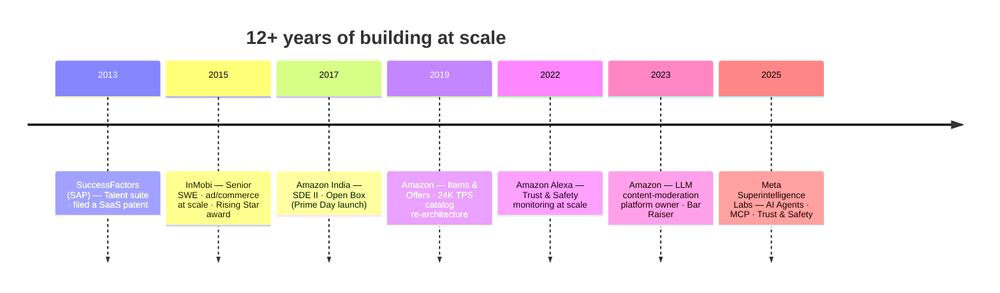

<!-- ════════════════════════════════  HEADER  ════════════════════════════════ -->

<a href="https://www.linkedin.com/in/yogeeshr/">
  
</a>

<p align="center">
  <a href="https://github.com/yogeeshr">
    
  </a>
</p>

<p align="center">
  <a href="https://www.linkedin.com/in/yogeeshr/"></a>
  
  
  
</p>

---

### 👋 About me

I'm a **Staff Software Engineer at Meta Superintelligence Labs**, with **12+ years** building large-scale systems at the intersection of **AI, Trust & Safety, and distributed infrastructure**.

- 🤖 Today I work on **MCP servers and agent frameworks** — building the next generation of AI systems *responsibly and at scale*.
- 🛡️ Previously the **single-threaded owner of Amazon's LLM content-moderation platform** — thousands of TPS serving billions of users, with Responsible AI baked in (safety, privacy, policy compliance).
- ⚡ Architected a **multi-year catalog re-architecture → 24K TPS at sub-100 ms latency**, cutting infrastructure cost by **~50%**.
- 🎯 An Amazon **Bar Raiser** — helped make hiring decisions on **350+ candidates**, raising the bar on **250+** of them.
- 🧭 I love taking **ambiguous, zero-to-one problems** from a blank page to a system that ships — operating fluidly across the macro architecture and the micro detail.

> *"I care deeply about building AI that is safe, scalable, and beneficial — and I bring that conviction to everything I ship."*

---

### 🚀 What I'm building now — Meta Superintelligence Labs

```text
focus      ░░  AI Agents · MCP servers · Agent frameworks
domain     ░░  Trust & Safety · Responsible AI
mandate    ░░  Build the next generation of AI systems — responsibly, at scale
principles ░░  Move Fast · Long-Term Impact · Build Awesome Things · Live in the Future
```

---

### 📈 Impact at a glance

| Scale | Reliability | Efficiency | Leadership |
|:--|:--|:--|:--|
| **Billions** of users served | **24K TPS** @ **<100 ms** p-latency | **~50%** infra cost reduction | **Bar Raiser**, 350+ interviews |
| **1000s of TPS** moderation platform | Single-threaded owner, LLM safety | **$400K/yr** saved via ML automation | Mentor across all org levels |

---

### 🧰 Tech & domains

<p>
  
  
  
  
  
  
  
  
  
</p>
<p>
  
  
  
  
  
  
</p>

---

### 🧭 Career path



---

### 📜 Patents & publications

- 📄 **Patent:** *Recommending Updates to an Instance in a SaaS Model* — SuccessFactors / SAP.
- 📰 **AWS Blog:** [Customer-defined partition keys for Amazon Timestream](https://aws.amazon.com/blogs/database/) — a design I contributed to, featured as a case study.

---

### 📊 GitHub stats

<p align="center">
  
  
</p>

<p align="center">
  
</p>

<p align="center">
  
</p>

---

### 🤝 Let's connect

<p>
  <a href="https://www.linkedin.com/in/yogeeshr/"></a>
  <a href="https://github.com/yogeeshr"></a>
</p>

<sub>📍 Bellevue, WA · 🎓 First Class with Distinction (9.21/10), SJCE Mysore · 🗣️ English · Hindi · Kannada</sub>


<!---
yogeeshr/yogeeshr is a ✨ special ✨ repository because its `README.md` (this file) appears on your GitHub profile.
--->
