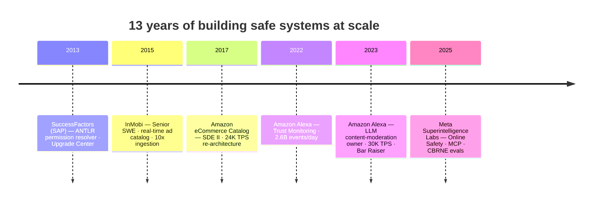

<!-- ════════════════════════════════  HEADER  ════════════════════════════════ -->

  

  
  
  
  

---

### 👋 About me

Staff-level engineer with **13 years** building **safety-critical AI/LLM systems at scale**. Deep expertise in **Responsible AI**, backend, and distributed systems — with a focus on **Trust & Safety** platforms that deliver **LLM guardrails across billions of daily interactions**.

- 🛡️ I architect **high-throughput distributed systems (30K+ TPS)** and embed **Safety, Security, Privacy, and Policy** directly into production AI products.
- 🤝 I lead **cross-functional initiatives across 20+ teams**, taking ambiguous, zero-to-one problems from PRFAQ to production.
- 🧭 I operate fluidly across **macro architecture and micro detail** — and I care deeply about building AI that is **safe, beneficial, and aligned with human values**.

> *"Changing lives for the better — through technology."*

---

### 🚀 What I'm building now — Meta Superintelligence Labs · *Staff SWE (Apr 2025 – Present)*

**🟦 Online System Safety — Meta AI *Muse Spark* launch**
Led end-to-end online safety detection that **gated the launch** of Muse Spark. Coordinated **20+ teams** (LLM Trust, Child Safety, Media Trust) to identify and mitigate every risk vector — **resolved 12 high-severity issues** and closed **all CSAM image/video entry points with zero project delay**, ramping fast on a novel **Rust** architecture. Held refusal rates and latency within target so guardrails never degraded UX.

**🟦 Training-Data Filtering Pipeline**
Built — ground up — a pre-training **data-sanitization** system for research scientists. Filters CSAM (image, novel video, MMS-bank), foreign-state narrative bias, and other policy violations. **~10M videos within a 6-hour SLA at <1% false-drop**, **fail-close** semantics, **100 parallel pipelines/day across 100 datasets (2TB each)** — zero delays to model launches. Coordinated 4 teams + 10 research stakeholders and shipped a companion E2E testing framework.

**🟦 MCP Server Platform for CBRNE Evals**
Designed and deployed a scalable **MCP server platform on AWS** — an extensible tool-augmented LLM framework where new tools plug in to evaluate model tool-use against **CBRNE** safety risks. Established a **repeatable, automated safety gate** for model releases.

---

### 📈 Impact at a glance

| Scale | Reliability | Efficiency | Leadership |
|:--|:--|:--|:--|
| **30K+ TPS** safety platforms | **2.6B events/day** @ **<200 ms** | **~50%** infra cost reduction | **20+ teams** aligned (PRFAQ → prod) |
| **Billions** of daily interactions | **<0.5%** policy-violating content | **$400K/yr** saved via ML automation | **Bar Raiser**, 350+ interviews |
| **~10M videos / 6-hr SLA** filtered | **<1%** false-drop, fail-close | **10x** ingestion throughput | 5 interns → FTE engineers |

---

### 💼 Selected work — Amazon (Oct 2017 – Apr 2025)

**Alexa AI · Privacy & Customer Trust — Senior SDE**
- **Single-threaded owner** of Alexa's end-to-end **LLM content-moderation** stack across all LLM experiences. Built guardrails — prompt/output overriding hotfixes + **pause-and-play** full-context detection — scaling to **30K TPS** and driving policy-violating content to **<0.5%** of traffic. Led 5 cross-functional teams.
- **Alexa Trust Monitoring System** — envisioned and championed a company-wide platform from zero (authored PRFAQ, secured funding, aligned **20+ teams**). Fault-tolerant architecture at **30K TPS / 2.6B events/day** under **200 ms**, established as the **authority for Alexa's go/no-go launch decisions**.

**eCommerce Catalog — SDE II**
- **Global Item Processing re-architecture** — multi-year overhaul of a legacy distributed catalog → **24K TPS @ <100 ms**, **50%** less artificial traffic, **2x** infra cost savings.
- **Automated data-quality + ML pipeline** — human-in-the-loop (35-person MTurk team) → automated SageMaker training/deploy → **10bps YoY** quality gain, **$400K/yr** saved.

**InMobi — Senior SWE** · real-time ad-serving catalog ingestion (Spring Boot, Elasticsearch): 40 merchants, **10M+ products/day, 10x** throughput; Hive audience segmentation **4 days → 2 hours**.
**SuccessFactors (SAP)** · binary expression-tree **permission resolver (ANTLR)** for fine-grained admin control — recognized by a Principal Engineer.

---

### 🧰 Tech & domains

  
  
  
  
  
  
  
  
  
  
  

  
  
  
  
  
  
  

---

### 🧭 Career path

---

### 🏆 Achievements & leadership

- 🎯 **Amazon Bar Raiser** — **350+** hiring interviews, owning the bar-raising function across engineering orgs.
- 🤖 **GuruConnect — company-wide hackathon winner** — AWS Bedrock AI assistant for on-call management, SOP retrieval, and DB querying.
- 📰 **AWS Timestream blog author** — co-authored the official post introducing **customer-defined partition keys** (first production implementation of the feature).
- 🔐 **Amazon Security Certifier** — security-certified **3 production systems/year** for customer-trust, privacy, and policy compliance.
- 🌱 **Mentorship** — grew **5 interns into full-time engineers**; ongoing coaching on career growth, system design, and engineering excellence.

---

### 📊 GitHub stats

  
  

  

  

---

### 🤝 Let's connect

  
  
  

📍 Bellevue, WA · 🎓 B.E. Computer Science, SJCE Mysuru — 9.21/10 · 🛡️ Safety · Security · Privacy · Policy

<!---
yogeeshr/yogeeshr is a ✨ special ✨ repository because its `README.md` (this file) appears on your GitHub profile.
--->
